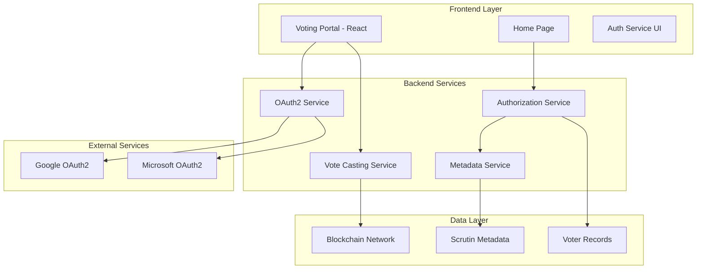
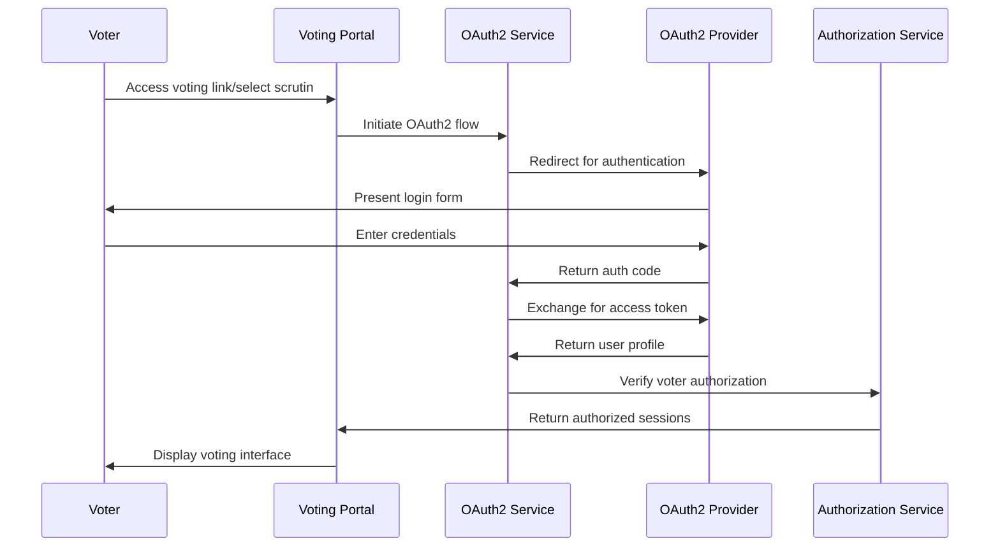
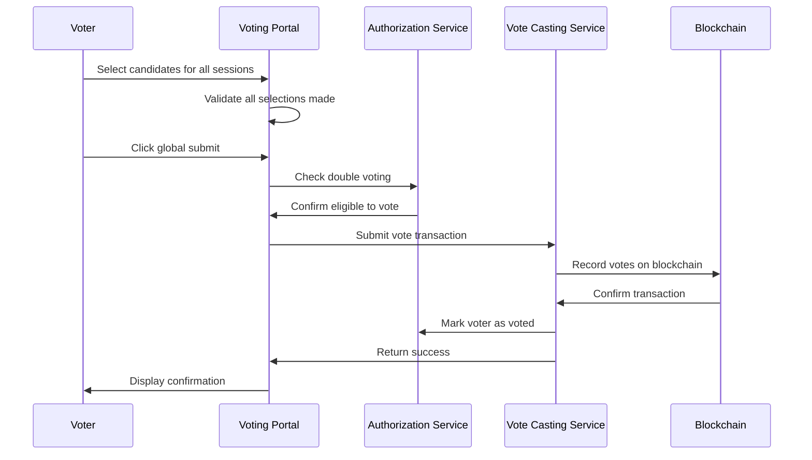

# Design Document: Voter Authentication and Voting System

## Overview

The voter authentication and voting system provides a secure, multi-session voting platform that integrates OAuth2 authentication with blockchain-based vote recording. The system supports two distinct entry flows: direct link access for immediate voting and home page entry with scrutin selection. 

The architecture leverages existing OAuth2 infrastructure and blockchain integration while adding voter authorization verification and multi-session vote management. The system ensures election integrity through double voting prevention and comprehensive error handling.

Key capabilities include:
- OAuth2 authentication via Google and Office 365
- Voter authorization verification against scrutin metadata
- Multi-session voting interface with global submission
- Double voting prevention per scrutin
- Integration with existing blockchain vote casting infrastructure

## Architecture

### System Components



### Authentication Flow



### Vote Submission Flow



## Components and Interfaces

### Frontend Components

#### VotingPortal Component
- **Purpose**: Main voting interface displaying all authorized sessions
- **Props**: 
  - `scrutinId`: String - Identifier for the current scrutin
  - `voterEmail`: String - Authenticated voter's email
- **State**: 
  - `sessions`: Array of session objects with candidates
  - `selections`: Map of sessionId to selected candidateId
  - `isSubmitting`: Boolean for submission state
- **Key Methods**:
  - `handleCandidateSelection(sessionId, candidateId)`: Updates vote selection
  - `handleGlobalSubmit()`: Submits all votes as single transaction
  - `validateAllSelections()`: Ensures all sessions have selections

#### HomePageEntry Component
- **Purpose**: Email entry and scrutin selection interface
- **State**:
  - `email`: String - Voter's email input
  - `availableScrutins`: Array of scrutin objects
  - `selectedScrutin`: String - Selected scrutin ID
- **Key Methods**:
  - `handleEmailSubmit()`: Fetches available scrutins for email
  - `handleScrutinSelection()`: Initiates OAuth flow for selected scrutin

#### AuthCallback Component
- **Purpose**: Handles OAuth2 callback and redirects to appropriate interface
- **Key Methods**:
  - `processAuthCallback()`: Processes OAuth response and fetches voter sessions

### Backend Services

#### Authorization Service
- **Endpoint**: `/api/auth/verify-voter`
- **Purpose**: Verifies voter authorization and returns accessible sessions
- **Methods**:
  - `verifyVoterAuthorization(email, scrutinId)`: Checks voter eligibility
  - `getAuthorizedSessions(email, scrutinId)`: Returns sessions voter can access
  - `checkDoubleVoting(email, scrutinId)`: Prevents duplicate voting
  - `markVoterAsVoted(email, scrutinId)`: Records vote submission

#### Scrutin Discovery Service
- **Endpoint**: `/api/scrutins/available`
- **Purpose**: Returns active scrutins for voter email
- **Methods**:
  - `getActiveScrutinsForVoter(email)`: Returns in-progress scrutins where voter is authorized

### API Endpoints

#### GET /api/scrutins/available
**Purpose**: Retrieve active scrutins for a voter email
**Request**:
```json
{
  "email": "voter@example.com"
}
```
**Response**:
```json
{
  "scrutins": [
    {
      "id": "scrutin-123",
      "name": "Presidential Election 2024",
      "country": "France",
      "status": "in_progress"
    }
  ]
}
```

#### POST /api/auth/verify-voter
**Purpose**: Verify voter authorization and return accessible sessions
**Request**:
```json
{
  "email": "voter@example.com",
  "scrutinId": "scrutin-123"
}
```
**Response**:
```json
{
  "authorized": true,
  "hasVoted": false,
  "sessions": [
    {
      "id": "session-1",
      "name": "Presidential Round 1",
      "candidates": [
        {
          "id": "candidate-1",
          "name": "John Doe",
          "party": "Democratic Party"
        }
      ]
    }
  ]
}
```

#### POST /api/votes/cast (Existing Endpoint)
**Purpose**: Submit votes for all sessions in a scrutin
**Request**:
```json
{
  "voterEmail": "voter@example.com",
  "scrutinId": "scrutin-123",
  "votes": [
    {
      "sessionId": "session-1",
      "candidateId": "candidate-1"
    }
  ]
}
```

## Data Models

### Scrutin Model
```typescript
interface Scrutin {
  id: string;
  name: string;
  country: string;
  status: 'not_started' | 'in_progress' | 'completed';
  sessions: Session[];
  globalVoters: string[]; // Email addresses authorized for all sessions
  createdAt: Date;
  startDate: Date;
  endDate: Date;
}
```

### Session Model
```typescript
interface Session {
  id: string;
  scrutinId: string;
  name: string;
  description?: string;
  candidates: Candidate[];
  authorizedVoters: string[]; // Session-specific authorized voters
  order: number; // Display order
}
```

### Candidate Model
```typescript
interface Candidate {
  id: string;
  sessionId: string;
  name: string;
  party?: string;
  description?: string;
  imageUrl?: string;
  order: number; // Display order
}
```

### Vote Transaction Model
```typescript
interface VoteTransaction {
  voterEmail: string;
  scrutinId: string;
  votes: Vote[];
  timestamp: Date;
  transactionHash?: string; // Blockchain transaction hash
}

interface Vote {
  sessionId: string;
  candidateId: string;
}
```

### Voter Record Model
```typescript
interface VoterRecord {
  email: string;
  scrutinId: string;
  hasVoted: boolean;
  votedAt?: Date;
  transactionHash?: string;
}
```

### OAuth User Profile Model
```typescript
interface OAuthUserProfile {
  email: string;
  name: string;
  provider: 'google' | 'microsoft';
  providerId: string;
  verified: boolean;
}
```
